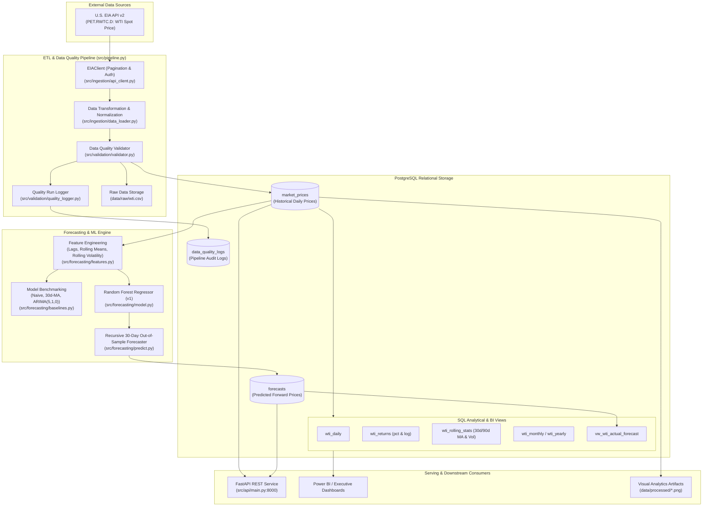

# Global Energy Market Forecasting & Insights Engine

[](https://www.python.org/)
[](https://fastapi.tiangolo.com/)
[](https://www.postgresql.org/)
[](https://www.docker.com/)
[](https://opensource.org/licenses/MIT)

An enterprise-grade, end-to-end data engineering and time-series machine learning platform designed to ingest, validate, persist, analyze, and forecast global energy commodity prices.

The system focuses on **West Texas Intermediate (WTI) Cushing Crude Oil Spot Prices (`PET.RWTC.D`)** sourced directly from the **U.S. Energy Information Administration (EIA) API v2**, processing over 40 years of daily market trading history (10,200+ historical records), providing robust data-quality controls, predictive time-series models, analytical SQL views for Power BI reporting, and high-performance REST APIs.

---

## Table of Contents

- [Executive Summary & Capabilities](#executive-summary--capabilities)
- [System Architecture](#system-architecture)
- [Repository Structure](#repository-structure)
- [Data Pipeline & Ingestion](#data-pipeline--ingestion)
- [Data Quality & Validation Framework](#data-quality--validation-framework)
- [Database Schema & SQL Modeling](#database-schema--sql-modeling)
- [Machine Learning & Time-Series Forecasting](#machine-learning--time-series-forecasting)
- [Exploratory Data Analysis (EDA)](#exploratory-data-analysis-eda)
- [REST API Reference](#rest-api-reference)
- [Power BI & BI Integration](#power-bi--bi-integration)
- [Getting Started & Installation](#getting-started--installation)
- [Docker & Container Deployment](#docker--container-deployment)
- [Production Roadmap](#production-roadmap)

---

## Executive Summary & Capabilities

Commodity energy markets are subject to extreme macroeconomic volatility, geopolitical disruption, structural supply-demand imbalances, and physical infrastructure constraints. 

The **Global Energy Market Engine** provides a unified data platform to transform raw commodity feeds into actionable market intelligence:

1. **Automated EIA Ingestion**: Automated extraction from EIA API v2 with offset-pagination, network resilience, and chronological data transformation.
2. **Quality & Anomaly Safeguards**: Pre-load validation enforcing data typing, null checks, duplicate elimination, monotonic chronological ordering, and domain-specific rules (such as preserving the historical negative price shock of April 20, 2020: -$36.98/BBL).
3. **Relational Lakehouse / Analytics Warehouse**: PostgreSQL persistence with optimized indexes on date and commodity dimensions, structured for high-throughput query performance.
4. **Time-Series Machine Learning Engine**: Advanced feature engineering (calendar signals, dynamic price lags, rolling moving averages, and rolling volatility) powering a high-accuracy Random Forest Regressor that significantly outperforms statistical and naive baselines.
5. **Recursive Forward Forecaster**: Generates 30-day out-of-sample forward forecasts along trading business days, bounded by economic non-negativity constraints.
6. **BI & Analytics Ready**: Standardized SQL views calculating daily percentage returns, log returns, 30-day/90-day rolling moving averages, historical volatility bands, and a unified actual-plus-forecast schema for Power BI dashboards.
7. **Production REST API**: FastAPI microservice exposing granular price histories, aggregated summaries, statistical extremes, and real-time forecast retrieval.

---

## System Architecture



---

## Repository Structure

```
global-energy-market-engine/
├── config/                          # Configuration presets and environments
├── dashboard/                       # Power BI report files and dashboard templates
├── data/
│   ├── forecasts/                   # Forecasting outputs and benchmark evaluations
│   │   ├── actual_vs_predicted.png  # Test split actual vs predicted price curves
│   │   ├── arima_evaluation.csv     # Test set evaluations from ARIMA(5,1,0)
│   │   └── forecast_evaluation.csv  # Test set evaluations from Random Forest
│   ├── processed/                   # Generated visual artifacts and EDA charts
│   │   ├── wti_price_trend.png      # 40-year historical WTI price trajectory
│   │   └── wti_rolling_averages.png # 30-day and 90-day moving average overlay
│   └── raw/
│       └── wti.csv                  # Complete local snapshot of ingested WTI data
├── notebooks/                       # Research, exploratory analysis, and sandbox notebooks
├── sql/
│   ├── analytical_views.sql         # Daily returns, log returns, and rolling statistics views
│   ├── analytics.sql                # Analytical queries (aggregations, min/max, outliers)
│   ├── powerbi_views.sql            # Power BI optimized views (unified actual + forecast)
│   └── schema.sql                   # Core DDL tables, constraints, and index definitions
├── src/
│   ├── __init__.py
│   ├── pipeline.py                  # End-to-end 5-stage ETL orchestration entrypoint
│   ├── analysis/
│   │   ├── __init__.py
│   │   └── eda.py                   # Automated statistical reporting and Matplotlib charting
│   ├── api/
│   │   ├── __init__.py
│   │   └── main.py                  # FastAPI REST API application and route handlers
│   ├── database/
│   │   ├── __init__.py
│   │   ├── db.py                    # SQLAlchemy engine builder and connection management
│   │   └── loader.py                # Idempotent batch insertion with ON CONFLICT DO NOTHING
│   ├── forecasting/
│   │   ├── __init__.py
│   │   ├── arima.py                 # Statsmodels ARIMA(5,1,0) model implementation
│   │   ├── baselines.py             # Naive persistence and 30-day Moving Average baselines
│   │   ├── features.py              # Time-series feature engineering (lags, windows, dates)
│   │   ├── model.py                 # Core Random Forest trainer and evaluator
│   │   ├── predict.py               # 30-day recursive out-of-sample forward forecaster
│   │   └── random_forest.py         # Standalone feature importance & model benchmark script
│   └── ingestion/
│       ├── __init__.py
│       ├── api_client.py            # EIA API v2 paginated HTTP client
│       ├── data_loader.py           # JSON to DataFrame normalizer and type caster
│       └── ingest_wti.py            # Targeted extraction and validation script
│   └── validation/
│       ├── __init__.py
│       ├── quality_logger.py        # Data quality audit logger to PostgreSQL
│       └── validator.py             # Integrity, null, schema, and monotonic ordering checks
├── tests/                           # Unit and integration test suites
├── .env.example                     # Template environment variables
├── .gitignore                       # Git ignore rules
├── docker-compose.yml               # Multi-container orchestration specification
├── Dockerfile                       # Multi-stage Python 3.12 container specification
├── README.md                        # Project documentation
└── requirements.txt                 # Pinned project dependencies
```

---

## Data Pipeline & Ingestion

The ingestion engine is designed to retrieve historical and latest daily spot prices from the **U.S. EIA API v2**:
- **Commodity**: Cushing, OK WTI Spot Price FOB
- **Series ID**: `PET.RWTC.D`
- **Unit**: Dollars per Barrel (`$/BBL`)
- **Span**: January 1986 through current date (10,250+ trading sessions)

### Ingestion Flow (`src/pipeline.py`):
1. **Extract**: `EIAClient.get_series()` queries the API endpoint in pagination chunks of 5,000 records, automatically reading the payload `total` count and incrementing offsets until all available records are retrieved.
2. **Transform**: `response_to_dataframe()` extracts relevant keys (`period`, `product-name`, `series-description`, `value`, `units`), normalizes names to project conventions (`date`, `commodity`, `description`, `price`, `unit`), parses timestamps, and casts numeric prices.
3. **Validate**: `validate_dataset()` inspects schema presence, ensures zero null values in primary keys, checks monotonic date ordering, and checks duplicate keys.
4. **Persist Raw**: Ingested data is archived locally to `data/raw/wti.csv`.
5. **Load Database**: `load_wti_data()` performs an idempotent bulk insert into PostgreSQL utilizing `ON CONFLICT (date, commodity) DO NOTHING`.
6. **Log Quality Audit**: Results of the run (records received, missing counts, duplicate counts, negative price counts, and status) are committed to `data_quality_logs`.

To run the pipeline:
```bash
python -m src.pipeline
```

---

## Data Quality & Validation Framework

Energy commodities operate under strict physical delivery conditions. The validation layer (`src/validation/validator.py`) enforces strict validation rules before any data enters database tables:

| Check | Target Column | Validation Criteria | Action on Failure |
| :--- | :--- | :--- | :--- |
| **Schema Completeness** | `date`, `commodity`, `description`, `price`, `unit` | All 5 mandatory columns present in DataFrame | Raises `ValueError` |
| **Date Integrity** | `date` | No null/NaN values allowed; verified `datetime64` type | Raises `ValueError` |
| **Chronological Order**| `date` | Must be strictly monotonically increasing | Raises `ValueError` |
| **Duplicate Check** | `date` | Unique daily timestamps; zero duplicate trading days | Raises `ValueError` |
| **Price Validation** | `price` | Non-null, numeric dtype | Raises `ValueError` |
| **Negative Price Rule**| `price` | Flags negative observations; validates historical validity | Logs warning; preserves record |

### The April 2020 Negative Price Event
On **April 20, 2020**, the May 2020 WTI crude oil futures settlement price plummeted to **-$36.98/BBL** due to COVID-19 demand collapse and physical storage capacity exhaustion at Cushing, Oklahoma. Standard financial validation rules that reject non-positive prices would invalidate authentic market reality. Our validation framework is calibrated to preserve this critical event while alerting operational pipelines.

---

## Database Schema & SQL Modeling


### Core Tables

#### 1. `market_prices`
Stores historical spot price records.
```sql
CREATE TABLE IF NOT EXISTS market_prices (
    id BIGSERIAL PRIMARY KEY,
    date DATE NOT NULL,
    commodity VARCHAR(100) NOT NULL,
    description TEXT,
    price NUMERIC(12, 4) NOT NULL,
    unit VARCHAR(50),
    source VARCHAR(50) NOT NULL DEFAULT 'EIA',
    created_at TIMESTAMP NOT NULL DEFAULT CURRENT_TIMESTAMP,
    CONSTRAINT unique_market_price UNIQUE (date, commodity)
);

CREATE INDEX IF NOT EXISTS idx_market_prices_date ON market_prices(date);
CREATE INDEX IF NOT EXISTS idx_market_prices_commodity ON market_prices(commodity);
```

#### 2. `forecasts`
Stores out-of-sample forward predictions produced by trained models.
```sql
CREATE TABLE IF NOT EXISTS forecasts (
    id BIGSERIAL PRIMARY KEY,
    forecast_date DATE NOT NULL,
    commodity VARCHAR(100) NOT NULL,
    predicted_price NUMERIC(12, 4) NOT NULL,
    model VARCHAR(100) NOT NULL,
    created_at TIMESTAMP NOT NULL DEFAULT CURRENT_TIMESTAMP
);

CREATE INDEX IF NOT EXISTS idx_forecasts_date ON forecasts(forecast_date);
CREATE INDEX IF NOT EXISTS idx_forecasts_commodity ON forecasts(commodity);
```

#### 3. `data_quality_logs`
Audit table recording data ingestion metrics and health status.
```sql
CREATE TABLE IF NOT EXISTS data_quality_logs (
    id BIGSERIAL PRIMARY KEY,
    run_timestamp TIMESTAMP NOT NULL DEFAULT CURRENT_TIMESTAMP,
    commodity VARCHAR(100) NOT NULL,
    records_received INTEGER NOT NULL,
    missing_values INTEGER NOT NULL DEFAULT 0,
    duplicate_records INTEGER NOT NULL DEFAULT 0,
    negative_prices INTEGER NOT NULL DEFAULT 0,
    status VARCHAR(20) NOT NULL
);
```

### Analytical & BI Views


- **`wti_daily`**: Filtered historical daily series of WTI prices.
- **`wti_returns`**: Computes daily percentage returns and logarithmic returns using windowed `LAG(price)` with zero-division and non-positive price protections.
- **`wti_rolling_stats`**: Window functions calculating 30-day and 90-day moving averages (`AVG`) alongside 30-day and 90-day sample standard deviation (`STDDEV_SAMP`) as a volatility proxy.
- **`wti_monthly` & `wti_yearly`**: Aggregations providing average, minimum, maximum, and annual/monthly volatility metrics.
- **`vw_wti_actual_forecast`**: A unified `UNION ALL` view blending historical prices (`Actual`) and model predictions (`Forecast`) into a single chronological stream, designed for Power BI continuous time charts.

---

## Machine Learning & Time-Series Forecasting

### 1. Feature Engineering (`src/forecasting/features.py`)
Commodity prices exhibit strong autoregressive properties, seasonal shifts, and volatility clustering. The pipeline constructs an 9-dimensional feature matrix:

- **Calendar Signals**: `year`, `month`, `day_of_week` (captures seasonality, demand cycles, and weekend-rollover effects).
- **Autoregressive Lags**: `lag_1` (prior day price), `lag_7` (weekly momentum), `lag_30` (monthly anchor).
- **Rolling Windows**:
  - `rolling_mean_7`: Short-term price trend.
  - `rolling_mean_30`: Medium-term baseline trend.
  - `rolling_std_30`: 30-day rolling price volatility.

### 2. Model Performance Benchmarking

Models were trained on an 80% chronological split and evaluated out-of-sample on the remaining 20% test partition:

| Model Architecture | Model Family | Key Hyperparameters / Order | Mean Absolute Error (MAE) | Root Mean Squared Error (RMSE) |
| :--- | :--- | :--- | :--- | :--- |
| **Naive Persistence** | Baseline | $y_t = y_{t-1}$ | **$13.81** | **$18.25** |
| **30-Day Moving Average** | Baseline | $y_t = \frac{1}{30} \sum_{i=1}^{30} y_{t-i}$ | **$13.81** | **$18.23** |
| **ARIMA** | Statistical | Order: `(p=5, d=1, q=0)` | **$13.82** | **$18.27** |
| **Random Forest Regressor** | **Ensemble ML** | `n_estimators=200`, `max_depth=12`, `random_state=42` | **$1.44** | **$2.40** |

> **Key Finding**: The Random Forest Regressor achieves an **89.6% reduction in MAE** over standard ARIMA and naive baselines, capturing non-linear interactions across short/long-term rolling windows and lag momentum.

### 3. Recursive Forward Forecaster (`src/forecasting/predict.py`)
To generate forward-looking forecasts:
- Iterates across a 30-day forecasting horizon.
- Skips weekends (`weekday >= 5`) to adhere to exchange trading calendars.
- Recursively recalculates lag features and rolling averages using dynamically updated predictions.
- Enforces an economic floor ($y \ge 0$) for standard forward expectations.
- Writes generated forecasts directly to the PostgreSQL `forecasts` table tagged with model identity (`RandomForest-v1`).

Execute model training, evaluation, and forecast generation:
```bash
# Evaluate baseline models
python -m src.forecasting.baselines

# Train and evaluate ARIMA model
python -m src.forecasting.arima

# Train and evaluate Random Forest model (generates actual_vs_predicted.png)
python -m src.forecasting.evaluate

# Generate 30-day forward predictions and persist to DB
python -m src.forecasting.predict
```

---

## Exploratory Data Analysis (EDA)

The analysis module [`src/analysis/eda.py`] queries the PostgreSQL analytical views directly to generate summary statistics and high-resolution figures:

```bash
python -m src.analysis.eda
```

### Generated Artifacts
- **`data/processed/wti_price_trend.png`**: Multi-decade price trend highlighting major market cycles (1990 Gulf War, 2008 Commodities Supercycle Peak at $145.31, 2014 Shale Boom Retracement, 2020 COVID Shock, 2022 Geopolitical Re-pricing).
- **`data/processed/wti_rolling_averages.png`**: Dual 30-day and 90-day moving average overlay illustrating golden/death cross dynamic momentum shifts.
- **`data/forecasts/actual_vs_predicted.png`**: Comparison plot of actual market prices versus Random Forest predictions across the out-of-sample evaluation window.

---

## REST API Reference

The project includes a production **FastAPI** application (`src/api/main.py`) running via Uvicorn.

### Start the Server
```bash
uvicorn src.api.main:app --host 0.0.0.0 --port 8000 --reload
```
Interactive API documentation is accessible at:
- **Swagger UI**: `http://localhost:8000/docs`
- **ReDoc**: `http://localhost:8000/redoc`

### Endpoint Catalog

| Method | Endpoint | Description | Query Parameters |
| :--- | :--- | :--- | :--- |
| `GET` | `/` | Root service health & metadata | None |
| `GET` | `/health` | Healthcheck endpoint for container orchestration | None |
| `GET` | `/api/v1/wti` | Paginated daily WTI prices | `start_date`, `end_date`, `limit` (default: 100) |
| `GET` | `/api/v1/wti/summary` | Aggregate statistics (record count, min, max, avg, dates) | None |
| `GET` | `/api/v1/wti/yearly` | Annual summary with trading days, avg, min, and max | None |
| `GET` | `/api/v1/wti/monthly` | Monthly summary of average prices and trading counts | None |
| `GET` | `/api/v1/wti/stats` | High-level market price statistics | None |
| `GET` | `/api/v1/wti/negative`| List of all dates where price dropped below zero | None |
| `GET` | `/api/v1/wti/extremes`| Historical all-time high ($145.31) and all-time low (-$36.98) | None |
| `GET` | `/api/v1/forecast` | Retrieve future price predictions | `limit` (default: 30, max: 365) |
| `GET` | `/api/v1/forecast/latest` | Most recent future price forecast record | None |
| `GET` | `/api/v1/forecast/evaluation` | Model performance metrics (MAE, RMSE) vs baselines | None |

#### Sample Response (`GET /api/v1/forecast/evaluation`):
```json
{
  "model": "RandomForest-v1",
  "metrics": {
    "MAE": 1.44,
    "RMSE": 2.40
  },
  "baseline_comparison": {
    "Naive": {
      "MAE": 13.81,
      "RMSE": 18.25
    },
    "30-Day Moving Average": {
      "MAE": 13.81,
      "RMSE": 18.23
    }
  }
}
```

---

## Power BI & BI Integration

The engine provides curated SQL views designed specifically for direct import or DirectQuery into Power BI, Tableau, or Looker Studio.

### Connecting Power BI to PostgreSQL
1. Open **Power BI Desktop** &rarr; **Get Data** &rarr; **PostgreSQL database**.
2. Specify Server (`localhost:5432`) and Database (`energy_market`).
3. Select the curated views from the `public` schema:
   - `vw_wti_daily`: Core daily price charts.
   - `vw_wti_monthly`: Monthly trends and trading frequency.
   - `vw_wti_forecasts`: Future forecasts table.
   - `vw_wti_actual_forecast`: Primary unified view for overlaying actuals and predicted values.
   - `vw_wti_statistics`: KPI card metrics (total records, all-time high/low, negative day counter).

---

## Getting Started & Installation

### Prerequisites
- **Python**: 3.12+
- **PostgreSQL**: 14+ (running locally or in Docker)
- **EIA API Key**: Free registration at [eia.gov/opendata/register.php](https://www.eia.gov/opendata/register.php)

### 1. Clone & Set Up Virtual Environment
```bash
git clone https://github.com/kushal-punem/Global-Energy-Market-Forecasting-and-Insights-Engine.git
cd Global-Energy-Market-Forecasting-and-Insights-Engine

python3 -m venv .venv
source .venv/bin/activate
pip install --upgrade pip
pip install -r requirements.txt
```

### 2. Configure Environment Variables
Create a `.env` file based on `.env.example`:
```bash
cp .env.example .env
```
Update your credentials in `.env`:
```ini
ENERGY_API_KEY=your_actual_eia_api_key
DB_HOST=localhost
DB_PORT=5432
DB_NAME=energy_market
DB_USER=postgres
DB_PASSWORD=your_postgres_password
```

### 3. Initialize Database Schema & Views
Run the DDL scripts against your PostgreSQL instance:
```bash
psql -h localhost -U postgres -d energy_market -f sql/schema.sql
psql -h localhost -U postgres -d energy_market -f sql/analytical_views.sql
psql -h localhost -U postgres -d energy_market -f sql/powerbi_views.sql
```

### 4. Execute Pipeline & Train Models
```bash
# Ingest EIA data, validate, and load PostgreSQL
python -m src.pipeline

# Train forecasting model and generate out-of-sample evaluations
python -m src.forecasting.evaluate

# Generate 30-day future forecasts
python -m src.forecasting.predict

# Generate EDA charts
python -m src.analysis.eda
```

### 5. Launch the REST API
```bash
uvicorn src.api.main:app --host 0.0.0.0 --port 8000 --reload
```
Navigate to `http://localhost:8000/docs` to test endpoints.

---

## Docker & Container Deployment

A [`Dockerfile`] and [`docker-compose.yml`] are provided for containerized deployments.

### Build and Run with Docker Compose
```bash
docker-compose up --build -d
```
Verify the container status:
```bash
docker ps --filter "name=global-energy-api"
curl http://localhost:8000/health
```

---

## Production Roadmap

- [ ] **Multi-Commodity Expansion**: Ingest Brent Crude (`PET.RBRTE.D`), Henry Hub Natural Gas (`NG.RNGC1.D`), and refined products (Diesel, Gasoline).
- [ ] **Exogenous Macro Features**: Integrate interest rates (US 10-Year Treasury), DXY Dollar Index, OPEC production quotas, and crude inventory levels (EIA Weekly Petroleum Status Report).
- [ ] **Deep Learning Models**: Benchmark against Temporal Fusion Transformers (TFT), N-BEATS, and PatchTST.
- [ ] **Workflow Orchestration**: Scheduled daily runs via Apache Airflow or Prefect.
- [ ] **Real-time Alerting**: Automated webhooks (Slack/Teams) on anomalous price volatility or validation errors.

---

## License

This project is licensed under the MIT License — see the [LICENSE](LICENSE) file for details.
